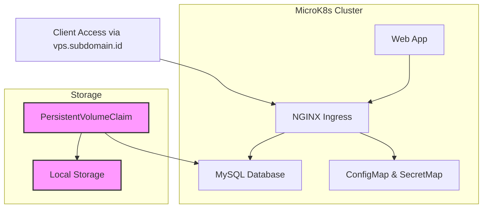

MicroK8s project with a web application from Docker Hub and a MySQL database, using local storage, ConfigMap, SecretMap, persistent storage, volume claim, and a storage class. We will also configure Ingress for external access using the domain vps.subdomain.id.



# Prerequisites
- MicroK8s installed on your machine
- Kubernetes CLI (kubectl) installed
- MicroK8s add-ons enabled (microk8s enable dns ingress storage)

## Step 1: Create a Storage Class for Local Storage
=======
Step 1: Create a Storage Class for Local Storage
Create a storage class for persistent storage in MicroK8s:

```yaml
# storage-class.yaml
kind: StorageClass
apiVersion: storage.k8s.io/v1
metadata:
  name: local-storage
provisioner: microk8s.io/hostpath
volumeBindingMode: Immediate
```

Apply the StorageClass:

```bash
kubectl apply -f storage-class.yaml
```

## Step 2: Create Persistent Volume and Claim for MySQL
=======
Step 2: Create Persistent Volume and Claim for MySQL
We will create a persistent volume (PV) and persistent volume claim (PVC) for the MySQL database using local storage.

```yaml

# mysql-pv.yaml
apiVersion: v1
kind: PersistentVolume
metadata:
  name: mysql-pv
spec:
  storageClassName: local-storage
  capacity:
    storage: 5Gi
  accessModes:
    - ReadWriteOnce
  hostPath:
    path: "/data/mysql"
---
# mysql-pvc.yaml
apiVersion: v1
kind: PersistentVolumeClaim
metadata:
  name: mysql-pvc
spec:
  storageClassName: local-storage
  accessModes:
    - ReadWriteOnce
  resources:
    requests:
      storage: 5Gi
```


Apply the PV and PVC:

```bash
kubectl apply -f mysql-pv.yaml
kubectl apply -f mysql-pvc.yaml
```


## Step 3: Create ConfigMap and Secret for MySQL
=======
Step 3: Create ConfigMap and Secret for MySQL
Create a ConfigMap for MySQL configuration and a Secret for sensitive information like MySQL root password.

```yaml
# mysql-configmap.yaml
apiVersion: v1
kind: ConfigMap
metadata:
  name: mysql-config
data:
  MYSQL_DATABASE: "mydatabase"
  MYSQL_USER: "myuser"
  MYSQL_PASSWORD: "mypassword"
```

```yaml
# mysql-secret.yaml
apiVersion: v1
kind: Secret
metadata:
  name: mysql-secret
type: Opaque
data:
  MYSQL_ROOT_PASSWORD: "cm9vdHBhc3N3b3Jk"  # base64-encoded password
```

Apply the ConfigMap and Secret:

```bash
kubectl apply -f mysql-configmap.yaml
kubectl apply -f mysql-secret.yaml
```

## Step 4: Deploy MySQL Database
=======
Step 4: Deploy MySQL Database
Now we will deploy a MySQL instance that uses the ConfigMap, Secret, and PVC.

```yaml
# mysql-deployment.yaml
apiVersion: apps/v1
kind: Deployment
metadata:
  name: mysql
spec:
  selector:
    matchLabels:
      app: mysql
  strategy:
    type: Recreate
  template:
    metadata:
      labels:
        app: mysql
    spec:
      containers:
        - image: mysql:5.7
          name: mysql
          env:
            - name: MYSQL_ROOT_PASSWORD
              valueFrom:
                secretKeyRef:
                  name: mysql-secret
                  key: MYSQL_ROOT_PASSWORD
            - name: MYSQL_DATABASE
              valueFrom:
                configMapKeyRef:
                  name: mysql-config
                  key: MYSQL_DATABASE
            - name: MYSQL_USER
              valueFrom:
                configMapKeyRef:
                  name: mysql-config
                  key: MYSQL_USER
            - name: MYSQL_PASSWORD
              valueFrom:
                configMapKeyRef:
                  name: mysql-config
                  key: MYSQL_PASSWORD
          ports:
            - containerPort: 3306
              name: mysql
          volumeMounts:
            - name: mysql-persistent-storage
              mountPath: /var/lib/mysql
      volumes:
        - name: mysql-persistent-storage
          persistentVolumeClaim:
            claimName: mysql-pvc
```

Apply the MySQL Deployment:

```bash
kubectl apply -f mysql-deployment.yaml
```

## Step 5: Deploy the Web Application
=======
Step 5: Deploy the Web Application
Use any Docker image from Docker Hub for the web application. In this example, we'll use nginx as a placeholder.

```yaml
# webapp-deployment.yaml
apiVersion: apps/v1
kind: Deployment
metadata:
  name: webapp
spec:
  replicas: 1
  selector:
    matchLabels:
      app: webapp
  template:
    metadata:
      labels:
        app: webapp
    spec:
      containers:
        - name: webapp
          image: nginx:latest
          ports:
            - containerPort: 80
```

Apply the web app deployment:

```bash
kubectl apply -f webapp-deployment.yaml
```


## Step 6: Create Services for MySQL and Web App
=======
Step 6: Create Services for MySQL and Web App
Expose both the MySQL database and the web application using services.

```yaml
# mysql-service.yaml
apiVersion: v1
kind: Service
metadata:
  name: mysql
spec:
  ports:
    - port: 3306
  selector:
    app: mysql
  type: ClusterIP
---
# webapp-service.yaml
apiVersion: v1
kind: Service
metadata:
  name: webapp
spec:
  ports:
    - port: 80
  selector:
    app: webapp
  type: ClusterIP
```

Apply the services:

```bash
kubectl apply -f mysql-service.yaml
kubectl apply -f webapp-service.yaml
```

## Step 7: Create an Ingress Resource
=======
Step 7: Create an Ingress Resource
We’ll create an Ingress to route external traffic to the web application via the domain vps.subdomain.id.

```yaml
# ingress.yaml
apiVersion: networking.k8s.io/v1
kind: Ingress
metadata:
  name: webapp-ingress
  annotations:
    nginx.ingress.kubernetes.io/rewrite-target: /
spec:
  rules:
    - host: vps.subdomain.id
      http:
        paths:
          - path: /
            pathType: Prefix
            backend:
              service:
                name: webapp
                port:
                  number: 80
```


Apply the Ingress:

```bash
kubectl apply -f ingress.yaml
```

## Step 8: Check the Ingress and Access the Web Application
=======
Step 8: Check the Ingress and Access the Web Application
To verify the Ingress, use the following command:

```bash
kubectl get ingress
```


Make sure that your domain (vps.subdomain.id) points to the external IP of your Kubernetes cluster. You can now access the web application through the domain http://vps.subdomain.id.

## Final Notes
=======
Final Notes
- You can modify the MySQL image version or web application image as needed.
- Ensure your DNS settings point vps.subdomain.id to the correct external IP of the MicroK8s cluster.
